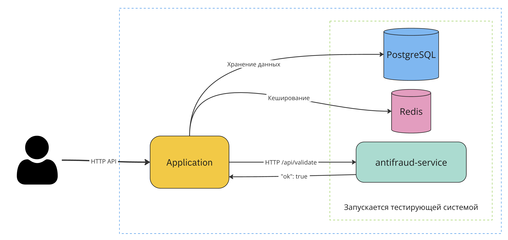
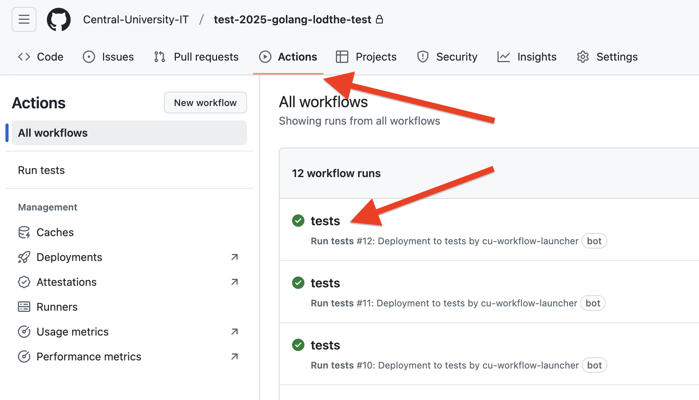
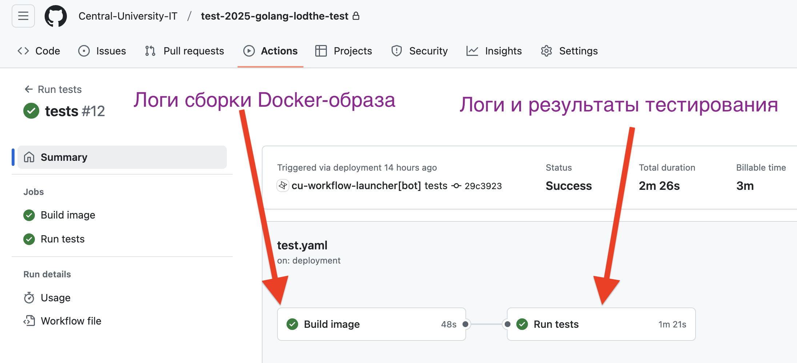
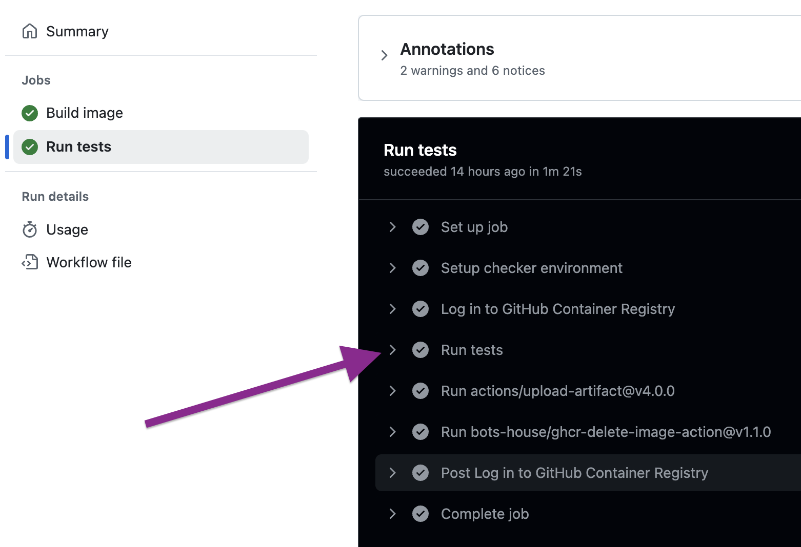

# PROMO v2: Promo Code Backend

> [!IMPORTANT]
> Ознакомьтесь с [FAQ (кликабельно!)](https://github.com/Central-University-IT/FAQ-2025/wiki/Backend) и полностью прочитайте условие перед обращением в бота поддержки!


Представьте, что вы работаете в динамичном стартапе, который занимается продвижением и агрегацией промокодов от различных компаний. Ваша платформа позволяет бизнесам создавать и настраивать промокоды с таргетингом, а конечным пользователям — легко находить и активировать промокоды и взаимодействовать с ними. Ваши коллеги разрабатывают фронтенд и другие части системы, но сейчас им срочно нужна ваша помощь в реализации надежного и масштабируемого бэкенда, который обеспечит все необходимые API-эндпоинты и пройдет все тесты по юзеркейсам. Это ваш шанс внести значимый вклад в успех стартапа и продемонстрировать свои навыки в области бэкенд-разработки!

Ваши коллеги разрабатывают инновационную платформу для управления промокодами, предназначенную как для бизнес-пользователей (B2B), так и для конечных потребителей (B2C).
В рамках B2B-части компания может управлять своими промокодами и получать статистику по их активации.
Конечным пользователям платформы доступна лента промокодов с базовым описанием, которое предоставляет компания.
Если пользователю нравится промокод, он может его активировать и получить значение, которое указала компания.
Чтобы избежать выгрузки базы промокодов недобросовестными пользователями, в компании уже реализован 
сервис антифрода, который будет отлавливать такое поведение.

В команде обсуждали, что вы знакомы с Git, HTTP, Docker, PostgreSQL, Redis и OpenAPI.
Помогите реализовать HTTP-сервер по имеющейся спецификации, коллеги будут сильно благодарны!

Результатом выполнения данного задания является репозиторий с исходным кодом приложения (директория `solution`).
Задание необходимо выполнять в личном (приватном) репозитории, созданным Classroom.

## Про приложение

Приложение должно представлять собой HTTP-сервер, реализующий необходимое [API](./api.yml). В наследие от предыдущей команды вам достались инстансы PostgreSQL и Redis, которые вы можете использовать для хранения данных (что именно использовать &mdash; решаете вы сами).

Приложение конфигурируется через переменные окружения:

- `SERVER_ADDRESS` &mdash; хост и порт, которые будет _слушать_ запущенный HTTP-сервер. Например, `0.0.0.0:8080`.

- `SERVER_PORT` &mdash; содержит порт; запущенный сервер должен слушать IP `0.0.0.0` и указанный порт. Используйте эту переменную, если вам не подошел формат данных в переменной `SERVER_ADDRESS` (переданные параметры равнозначны).

- `POSTGRES_CONN` &mdash; URL-строка для подключения к PostgreSQL в формате `postgres://{username}:{password}@{host}:{5432}/{dbname}`.

- `POSTGRES_JDBC_URL` &mdash; JDBC-строка для подключения к PostgreSQL в формате `jdbc:postgresql://{host}:{port}/{dbname}`.

- `POSTGRES_USERNAME` &mdash; имя пользователя для подключения к PostgreSQL.

- `POSTGRES_PASSWORD` &mdash; пароль для подключения к PostgreSQL.

- `POSTGRES_HOST` &mdash; хост для подключения к PostgreSQL (например, `localhost`).

- `POSTGRES_PORT` &mdash; порт для подключения к PostgreSQL (например, `5432`).

- `POSTGRES_DATABASE` &mdash; имя базы данных PostgreSQL, с которой должно работать приложение.

- `REDIS_HOST` &mdash; хост для подключения к Redis (например, `localhost`).

- `REDIS_PORT` &mdash; порт для подключения к Redis (например, `6379`).

- `ANTIFRAUD_ADDRESS` &mdash; адрес (домен или IP) и порт API сервиса антифрода для подключения по HTTP (например, `localhost:9090`).

- `RANDOM_SECRET` &mdash; псевдослучайная последовательность из 128 символов (a-z, A-Z, 0-9), сгенерированная тестирующей системой. Можете использовать ее, если вашему приложению необходим секретный ключ (например, для JWT). Если вам не требуется данное значение, можете его не использовать. Значение одинаковое в рамках запуска группы тестов.

Автор приложения сам выбирает, с какими из переменных окружения ему комфортно работать.

Учитывая современные реалии, приложение будет запускаться через Docker-контейнер. В репозитории присутствует Dockerfile, с помощью которого будет собираться образ приложения. 
Так как приложение сравнительно небольшое, мы обойдемся одним Docker-контейнером, docker compose определить не получится.

**Список используемых зависимостей (и фреймворков) не ограничен** (любая версия языка программирования, без ограничений на библиотеки), однако вы должны убедиться, что необходимые зависимости загружаются и подключаются в Dockerfile. Вы сами вправе выбирать стек вашего приложения, от вас зависит успех всего проекта!
Вы вправе выбирать любой язык программирования, но если его нет среди списка поддерживаемых, в случае проблем
мы не сможем помочь. Настоятельно рекомендуем выбирать ЯП среди поддерживаемых.

Описание API находится ниже, но если вы хотите ознакомиться с точными требованиями, не стесняйтесь использовать Swagger и предоставленную [спецификацию Open API](./api.yml).

Тестирование решения происходит с помощью Github CI. Для отправки решения на тестирование необходимо обновить исходный код вашего репозитория на Github (git commit & git push). Вам нужно разработать приложение, которое будет 
подключаться к существующим СУБД и сервису антифрода.

**Тестирующая система самостоятельно запустит PostgreSQL, Redis и другие зависимости.**
Вы можете запустить данные СУБД и другие зависимости локально для проведения локального тестирования,
но это никак не повлияет на тестирование в Github CI.

Версии запущенных зависимостей: PostgreSQL 16.6 и Redis 7.4. 
Подключение к Redis необходимо выполнять без пароля, к стандартной db (0).

**Вы можете редактировать файлы в директории `solution` (и `.gitignore` в корне). Если в репозитории содержатся изменения в других файлах, решение не будет принято.**



## Важная деталь: Антифрод

Помимо основной функциональности в платформе есть дополнительная проверка пользователя при активации промокода — **антифрод**. Данный сервис уже реализован на стороне компании и представляет собой мощный инструмент, который с помощью алгоритмов искусственного интеллекта оценивает, не пытается ли пользователь «выгрузить» все промокоды платформы (или не занимается ли он другими мошенническими действиями).

Ваше решение должно обращаться к сервису антифрода, когда пользователь делает запрос на получение значения промокода.

### Эндпоинт антифрода

Сервис антифрода предоставляет единственный эндпоинт:

```
POST ${ANTIFRAUD_ADDRESS}/api/validate
```

#### Запрос

```json
{
  "user_email": "user@example.com",
  "promo_id": "PROMO12345"
}
```

- **user_email** (`string`) — e-mail пользователя, пытающегося активировать промокод.
- **promo_id** (`string`) — идентификатор промокода, который пользователь активирует.

В запросах должен быть указан заголовок `Content-Type: application/json`.

#### Ответ

```json
{
  "ok": true,
  "cache_until": "2025-01-16T00:17:57.567"
}
```

- **ok** (`boolean`) — указывает, разрешена ли активация промокода (`true`) или нет (`false`).
- **cache_until** (`string`) — **если присутствует**, указывает момент времени (UTC+0), до которого ответ антифрода **необходимо** кешировать. Повторные обращения того же пользователя к любому (или именно к тому же) промокоду не должны снова вызывать антифрод до истечения данного срока; ваше приложение должно считать, что вердикт в течение указанного времени остается прежним.

### Логика работы с антифродом

1. При каждой **новой** попытке пользователя активировать промокод ваш бэкенд **должен** отправить запрос в антифрод-сервис.
2. Если сервис отвечает с `status code` != `200`, нужно повторить запрос еще один раз. Если второй запрос также не вернул `200`, нужно отказать пользователю в активации.
3. Если `ok = false` в теле ответа, необходимо отказать в активации промокода.
4. Если в ответе содержится поле `cache_until`, то при повторной активации **любого** промокода (или именно этого `promo_id` — решение за автором) от того же пользователя до момента, указанного в `cache_until`, **не** нужно повторно обращаться в антифрод; достаточно использовать закешированный результат.
5. По истечении `cache_until` (или если `cache_until` не было возвращено в ответе) при следующей попытке активации промокода **необходимо** повторно делать запрос в антифрод.

Требования по корректному использованию `cache_until` строгие. Тестирующая система будет проверять их выполнение.

## Оценивание

Тестирование выполняется по группам тестов. В таблице представлены описание каждой группы тестов.

Группы тестов могут зависеть друг от друга. Если группа B зависит от группы A, при тестировании группы B могут использоваться эндпоинты, участвовавшие в тестировании группы A. Это свойство транзитивно!
При этом тестирующая система всегда проверяет все группы тестов, вне зависимости от результатов проверки других групп.

| Название группы              | Описание                                                     | Баллы | От каких групп зависит          |
|------------------------------|--------------------------------------------------------------|-------|---------------------------------|
| 01`/ping`                    | Успешный ответ на `GET /api/ping`                           | 1     |                                 |
| 02`/business/auth/sign-up`   | Регистрация новой компании                                  | 3     |                                 |
| 03`/business/auth/sign-in`   | Аутентификация компании и получение токена доступа          | 4     | 02/business/auth/sign-up      |
| 04`/business/promo/create`   | Создание нового промокода                                   | 6     | 03/business/auth/sign-in      |
| 05`/business/promo/list`     | Получение списка промокодов компании                        | 8    | 04/business/promo/create      |
| 06`/business/promo/{id}`     | Получение и редактирование промокода по ID                  | 9    | 05/business/promo/list        |
| 07`/user/auth/sign-up`       | Регистрация нового пользователя                             | 3     |                                 |
| 08`/user/auth/sign-in  `     | Аутентификация пользователя и получение токена доступа      | 3     | 07/user/auth/sign-up          |
| 09`/user/profile`            | Получение и редактирование профиля пользователя            | 6     | 08/user/auth/sign-in          |
| 10`/user/feed`               | Получение ленты промокодов                                  | 14    | 09/user/profile; 06/business/promo/{id}               |
| 11`/user/promo/{id}/like`    | Лайки и удаление лайков промокодов                          | 7    | 10/user/feed                  |
| 12`/user/promo/{id}/comments` | Управление комментариями к промокодам                       | 10    | 10/user/feed                  |
| 13`/user/promo/{id}/activate` | Активация промокода и получение исторической сводки                          | 20    | 11/user/promo/{id}/like; 12/user/promo/{id}/comments                  |
| 14`/business/promo/{id}/stat` | Получение статистики по промокоду                            | 6    | 13/user/promo/{id}/activate         |

Одна группа тестов может быть разделена на несколько шагов. Чтобы получить баллы за шаг, необходимо
пройти все тесты в рамках данного шага. Один шаг может представлять собой отправку и валидацию HTTP
запросов к решению, перезагрузку приложения, выполнение системных действий (замедление сервиса 
антифрода) и прочее. Если один из шагов не проходит валидацию, последующие шаги в рамках данной группы тестов не проверяются 
(и баллы за них не начисляются).
Распределение баллов по шагам будет доступно после проведения финального тестирования.

Обратите внимание! Ваше решение должно хранить данные в СУБД. Чтобы проверить это,
 тестирующая система может перезагружать ваше приложение (повторно дожидаясь готовности, отправляя запросы на `/api/ping`).
Гарантируется, что перезагрузка приложения будет выполняться после того, как приложение ответит на все поступившие ранее запросы.
При перезагрузке **не сохраняются** файлы, которые приложение сохранило на диск (не получится использовать sqlite).
Если ваше решение не может восстановить состояние из предоставленных СУБД (PostgreSQL, Redis), 
вы можете не получить баллы за группу тестов :(

Время на запуск тестов ограничено: 20 минут. Время на запуск группы тестов тоже может быть ограничено, ознакомьтесь
с конфигурационным файлом тестов.

Чтобы получить полный балл, **время обработки каждого HTTP-запроса не должно превышать 200 миллисекунд**. 
Если решение не кеширует ответы сервиса антифрода, возможно получение частичных баллов за некоторые группы тестов.

В спорных ситуациях будет оцениваться качество кода.

На данный момент в CI тестирование производится **на публичном наборе тестов**. Данные тесты помогают проверить минимальную логику приложения, **но не гарантируют прохождения финальных тестов**.
Публичный набор тестов будет пополняться примерами.
Финальные тесты будут более полными и будут проверять больше крайних случаев.

При финальном тестировании будут учитываться только те ограничения, что описаны в данном файле и [спецификации](./api.yml).

## Группы тестов

### Общие требования

**У всех эндпоинтов есть префикс `/api`.**

Обратите внимание, возврат успешного ответа на `GET /api/ping` является **обязательным условием для начала тестирования приложения**.

Поступающие запросы и возвращаемые ответы должны соответствовать структуре и требованиям, описанным в [спецификации Open API](./api.yml). Обращайте внимание на ожидаемые status code, ограничения по длине и разрешенные символы в строках.

Если структура запроса не соответствует требованиям и описанному формату, по умолчанию возвращается код ответа 400. 
Если указан более специфичный код ответа, используйте его.
Если запрос подразумевает указание токена, а пользователь его не предоставил, возвращайте 401.

Если запрос некорректен хотя бы в одном параметре, весь запрос отвергается и признается некорректным.

При ответе на запросы, подразумевающие пагинацию, сервер должен возвращать заголовок `X-Total-Count`
с суммарным числом элементов, подходящих под критерии фильтрации.

В случае, когда сервер должен создать новую сущность и назначить ей идентификатор, используйте UUID (любой версии).

При возвращении ошибок вы можете использовать произвольную структуру тела ответа. Тестирующая система будет проверять только status code (400, 409 и прочие).

### 01/ping

Достаточно реализовать возврат успешного ответа (с кодом `200`) на запрос `GET /api/ping`. Содержимое тела ответа при этом не валидируется, можно возвращать `"PROOOOOOOOOOOOOOOOOD"`.

Данная логика является блокирующей для всех остальных групп тестов. 

### 02/business/auth/sign-up

Эндпоинт `/business/auth/sign-up` используется для регистрации новой компании.

Сервер должен поддерживать базу данных компаний, валидировать запросы и не допускать наличия компаний с эквивалентными регистрационными данными. 

Не храните пароли компаний в [открытом виде](https://security.stackexchange.com/questions/36833/why-should-i-hash-passwords), используйте хеширование (например, bcrypt).

**Дополнения:**
- Если хотя бы один переданный параметр является некорректным, весь запрос считается некорректным и возвращается `400 Bad Request`.
- Убедитесь, что название компании не превышает разумных значений.

### 03/business/auth/sign-in

Эндпоинт `/business/auth/sign-in` предназначен для аутентификации компании по e-mail и паролю и генерации токена доступа,
который в дальнейшем будет использоваться для авторизованных запросов.

Генерируемый токен должен уникально идентифицировать компанию и быть сложным для подбора (можно использовать JWT, можно использовать другой формат токена).

Данный токен в дальнейшем будет передаваться компанией в заголовке `Authorization: Bearer {token}`, и приложение должно уметь понять, какая компания хочет сделать запрос.

Временно будем считать, что время действия токена (TTL) должно составлять от 1 до 24 часов (на усмотрение разработчика).

**Дополнения:**
- Обеспечьте, чтобы e-mail соответствовал требованиям безопасности (корректный формат).
- Пароль должен соответствовать требованиям безопасности (соблюдение политики сложности).
- Успешная аутентификация приводит к инвалидации всех ранее выпущенных токенов.

### 04/business/promo/create

Эндпоинт `/business/promo` используется для создания нового промокода.

**POST /business/promo**

Создание нового промокода с настройкой таргетинга и типом промокода (COMMON или UNIQUE).

COMMON-промокоды имеют фиксированное значение (например, `winter-sale-50`). Компания может ограничить
число активаций данного промокода. Каждая активация данного промокода отдаёт пользователю фиксированное значение.

Для UNIQUE-промокодов компания передает уникальный список промокодов. При активации промокода
пользователь должен получить очередное значение, которое ранее не было выдано. 
При этом бэкенд может не валидировать уникальность переданных значений (ответственность лежит на компании).
Если все указанные компанией значения были активированы, промокод принимает значение `active = false`.
Промокоды такого типа могут использоваться, когда компания хочет явно знать, с какой площадки пришел пользователь.

Опционально компания может определить настройки таргетинга для промокода. Если они определены,
промокод должен показываться и быть доступен для активации только пользователям, соответствующим 
указанным критериям (по возрасту и стране).
Поле `target` является обязательным для передачи, но его содержимое может быть пустым.

- **Требования**:
  - Аутентификация через `Authorization`-заголовок.
  - Валидация данных промокода согласно схеме `PromoCreate`.
  - Генерация уникального `id` для промокода.

### 05/business/promo/list

Эндпоинт `/business/promo` используется для получения списка промокодов компании.

**GET /business/promo**

Получение списка промокодов с возможностью фильтрации, сортировки и пагинации.

- **Требования**:
  - Аутентификация через `Authorization`-заголовок.
  - Поддержка параметров `limit`, `offset`, `sort_by`, `country`.

Параметр `sort_by` позволяет сортировать по дате начала/конца действия промокода. 
По умолчанию &mdash; сортируется в порядке создания промокодов. Сортировка всегда выполняется по убыванию.
Если существует несколько корректных порядков сортировки, вы можете вернуть любой.

Параметр `country` позволяет указать стран целевой аудитории в формате ISO 3166-1 alpha-2, по которому нужно фильтровать промокоды. В ответе должны содержаться промокоды либо без указанного региона (таргетинг), либо с регионом, который присутствует среди указанного списка при фильтрации. Если параметр не указан, подходят промокоды с произвольным регионом.
Пользователь может указать несколько стран, в таком случае на бэкенд будет отправлен запрос вида `...&country=ru&country=fr&country=us` или `...&country=ru,fr,us` (необходимо поддержать оба варианта).

**Дополнения:**
- Если хотя бы один переданный параметр фильтрации (например, `country`) некорректен, возвращайте `400 Bad Request`.
- Реализуйте регистрозависимый поиск по параметрам фильтрации.
- Не забывайте про заголовок `X-Total-Count`.

### 06/business/promo/{id}

Эндпоинт `/business/promo/{id}` используется для получения и редактирования промокода по его `id`.

**GET /business/promo/{id}**

- **Описание**: получение данных промокода по его ID.
- **Требования**:
  - Аутентификация через `Authorization`-заголовок.
  - Проверка принадлежности промокода компании.
- **Ответы**:
  - `200 OK` с данными промокода.
  - `400 Bad Request` при некорректных параметрах.
  - `403 Forbidden`, если промокод не принадлежит компании.
  - `404 Not Found`, если промокод не найден.

**PATCH /business/promo/{id}**

- **Описание**: редактирование данных промокода по его ID.
- **Требования**:
  - Аутентификация через `Authorization`-заголовок.
  - Валидация данных согласно схеме `PromoPatch`.
  - Проверка принадлежности промокода компании.
  - Если передано поле `target`, вся структура с таргетированными настройками перезаписывается.
- **Ответы**:
  - `200 OK` с обновленными данными промокода.
  - `400 Bad Request` при некорректных параметрах.
  - `403 Forbidden`, если промокод не принадлежит компании.
  - `404 Not Found`, если промокод не найден.

**Дополнения:**
- Убедитесь, что при редактировании промокода соблюдаются все ограничения по длине и форматированию полей.
- Если промокод принадлежит другой компании, возвращайте `403 Forbidden`.

### 07/user/auth/sign-up

Эндпоинт `/user/auth/sign-up` используется для регистрации нового пользователя.

На один и тот же e-mail одновременно может быть зарегистрирован аккаунт компании и аккаунт конечного пользователя.

- **Описание**: регистрация нового пользователя с необходимыми данными.
- **Требования**:
  - Валидация данных согласно схеме `User`.
  - Хеширование пароля.
  - Проверка уникальности e-mail.
- **Ответы**:
  - `200 OK` с `token`.
  - `400 Bad Request` при ошибке в данных запроса.
  - `409 Conflict`, если e-mail уже зарегистрирован.

**Дополнения:**
- Если хотя бы один переданный параметр является некорректным, весь запрос считается некорректным и возвращается `400 Bad Request`.
- Убедитесь, что длина e-mail и пароля соответствует требованиям безопасности.

### 08/user/auth/sign-in

Эндпоинт `/user/auth/sign-in` предназначен для аутентификации пользователя по e-mail и паролю и генерации токена доступа.

- **Описание**: аутентификация пользователя и получение `token`.
- **Требования**:
  - Валидация e-mail и пароля.
  - Генерация JWT-токена.
- **Ответы**:
  - `200 OK` с `token`.
  - `401 Unauthorized` при неверном e-mail или пароле.

**Дополнения:**
- Обеспечьте, чтобы e-mail соответствовал требованиям безопасности.
- Пароль должен соответствовать требованиям безопасности.
- Успешная аутентификация инвалидирует ранее выданные токены для данного пользователя.

### 09/user/profile

Эндпоинт `/user/profile` используется для получения и редактирования профиля пользователя.

**GET /user/profile**

- **Описание**: получение данных профиля текущего пользователя.
- **Требования**:
  - Аутентификация через `Authorization`-заголовок.
- **Ответы**:
  - `200 OK` с данными профиля.
  - `401 Unauthorized`, если пользователь не авторизован.

**PATCH /user/profile**

- **Описание**: обновление настроек пользователя.
- **Требования**:
  - Аутентификация через `Authorization`-заголовок.
  - Валидация данных согласно схеме `UserPatch`.
- **Ответы**:
  - `200 OK` с обновленными данными профиля.
  - `400 Bad Request` при ошибке в данных запроса.
  - `401 Unauthorized`, если пользователь не авторизован.

**Дополнения:**
- При обновлении профиля передавайте только те поля, что необходимо изменить.
- Убедитесь, что при обновлении настроек соблюдаются все требования к форматированию и длине полей.

### 10/user/feed

**GET /user/feed**

Эндпоинт `/user/feed` используется для получения ленты промокодов.

Обратите внимание: данный эндпоинт используется пользователем для получения базовой информации о промокодах.
В рамках данного эндпоинта пользователь не должен видеть значений промокодов, то есть процедуры активации не происходит.

Сервер при этом оперирует понятием «активного» промокода.
Промокод считается активным (и возможным для активации пользователями), если:   
- Текущая дата входит в указанный промежуток [active_from; active_until]. Ориентируйтесь на часовой пояс UTC+3.
- Для mode = COMMON число активаций меньше max_count.
- Для mode = UNIQUE остались неактивированные значения.

- **Описание**: получение списка активных промокодов с поддержкой пагинации, фильтрации и сортировки.
- **Требования**:
  - Аутентификация через `Authorization`-заголовок.
  - Поддержка параметров `limit`, `offset`, `category`, `active`.
- **Ответы**:
  - `200 OK` с массивом промокодов.
  - `401 Unauthorized`, если пользователь не авторизован.

**Дополнения:**
- Если хотя бы один переданный параметр фильтрации (например, `category` или даты) некорректен, возвращайте `400 Bad Request`.
- Реализуйте регистрозависимый поиск по параметрам фильтрации.

**GET /user/promo/{id}**

Данный эндпоинт используется для получения информации по одному промокоду. Активации промокода не происходит.

- **Требования**:
  - Аутентификация через `Authorization`-заголовок.
  - Поддержка параметров `id`.

- **Ответы**:
  - `200 OK` с массивом промокодов.
  - `401 Unauthorized`, если пользователь не авторизован.
  - `404 Not Found`, если промокода с указанным ID не существует.

### 11/user/promo/{id}/like

Эндпоинт `/user/promo/{id}/like` используется для управления лайками промокодов.

**POST /user/promo/{id}/like**

- **Описание**: добавление лайка к промокоду.
- **Требования**:
  - Аутентификация через `Authorization`-заголовок.
  - Проверка существования промокода.
- **Ответы**:
  - `200 OK` с подтверждением.
  - `401 Unauthorized`, если пользователь не авторизован.
  - `404 Not Found`, если промокода с указанным ID не существует.

**DELETE /user/promo/{id}/like**

- **Описание**: удаление лайка с промокода.
- **Требования**:
  - Аутентификация через `Authorization`-заголовок.
  - Проверка существования промокода.
- **Ответы**:
  - `200 OK` с подтверждением.
  - `401 Unauthorized`, если пользователь не авторизован.
  - `404 Not Found`, если промокода с указанным ID не существует.

**Дополнения:**
- Поддержите идемпотентность. Если пользователь пытается поставить лайк повторно (либо удалить несуществующий лайк), сервер должен ответить 200 и не обновлять число лайков.

### 12/user/promo/{id}/comments

Эндпоинт `/user/promo/{id}/comments` используется для управления комментариями к промокодам.

**POST /user/promo/{id}/comments**

- **Описание**: добавление комментария к промокоду.
- **Требования**:
  - Аутентификация через `Authorization`-заголовок.
  - Валидация текста комментария.
- **Ответы**:
  - `201 Created` с данными комментария.
  - `401 Unauthorized`, если пользователь не авторизован.
  - `404 Not Found`, если промокода с указанным ID не существует.

**GET /user/promo/{id}/comments**

- **Описание**: получение списка комментариев к промокоду.
- **Требования**:
  - Аутентификация через `Authorization`-заголовок.
  - Поддержка параметров `limit`, `offset`.
- **Ответы**:
  - `200 OK` с массивом комментариев.
  - `401 Unauthorized`, если пользователь не авторизован.
  - `404 Not Found`, если промокода с указанным ID не существует.

**PUT /user/promo/{id}/comments/{comment_id}**

- **Описание**: редактирование текста комментария.
- **Требования**:
  - Аутентификация через `Authorization`-заголовок.
  - Валидация нового текста комментария.
  - Проверка принадлежности комментария пользователю.
- **Ответы**:
  - `200 OK` с обновленными данными комментария.
  - `401 Unauthorized`, если пользователь не авторизован.
  - `403 Forbidden`, если комментарий не принадлежит пользователю.
  - `404 Not Found`, если промокода или комментария не существует.

**DELETE /user/promo/{id}/comments/{comment_id}**

- **Описание**: удаление комментария.
- **Требования**:
  - Аутентификация через `Authorization`-заголовок.
  - Проверка принадлежности комментария пользователю.
- **Ответы**:
  - `200 OK` с подтверждением удаления.
  - `401 Unauthorized`, если пользователь не авторизован.
  - `403 Forbidden`, если комментарий не принадлежит пользователю.
  - `404 Not Found`, если промокода или комментария не существует.

**Дополнения:**
- Убедитесь, что текст комментария соответствует требованиям по длине.
- При редактировании или удалении комментария проверяйте, что комментарий принадлежит текущему пользователю.

### 13/user/promo/{id}/activate

**POST user/promo/{id}/activate**

Эндпоинт `/user/promo/{id}/activate` используется для активации промокода пользователем.
Под активацией подразумевается возможность увидеть само значение промокода со стороны пользователя.
Все пользовательские эндпоинты, кроме этого, не раскрывают значение промокода.

Промокод может быть активирован, если:
- Промокод находится в активном состоянии (active = true).
- Пользователь соответствует настройкам таргетирования промокода. Для указанных настроек таргетирования промокода настройки пользователя имеют необходимое значение. Настройки категорий при этом не учитываются.
- Антифрод-сервис отдал успешный вердикт по этому пользователю.
- Соблюдены условия по max_count (для COMMON) и остались неактивированные промокоды (для UNIQUE).

В рамках данной группы тестов будет проверяться, что ваше решение действительно обращается к сервису
антифрода и кеширует его ответы. 

- **Требования**:
  - Аутентификация через `Authorization`-заголовок.
  - Проверка возможности использования промокода пользователем.
- **Ответы**:
  - `200 OK` с подтверждением активации промокода.
  - `400 Bad Request` при ошибке активации.
  - `403 Forbidden`, если промокод не может быть использован (исходя из ответа антифрод-сервиса или настроек таргетинга; или если active = false).
  - `404 Not Found`, если промокод не существует.

**Дополнения:**
- При активации промокода проверяйте, что промокод активен и доступен для текущего пользователя.
- Обеспечьте, что промокод не может быть активирован повторно, если это предусмотрено логикой (например, для UNIQUE-промокодов).

**GET /user/promo/history**

Данный эндпоинт позволяет пользователю получить историческую сводку по активированным промокодам.

Смотрите требования в спецификации!

### 14/business/promo/{id}/stat

Эндпоинт `/business/promo/{id}/stat` используется компаниями для получения статистики по промокоду.

**GET /business/promo/{id}/stat**

- **Описание**: получение статистики использования промокода по его ID.
- **Требования**:
  - Аутентификация через `Authorization`-заголовок.
  - Проверка принадлежности промокода компании.
- **Ответы**:
  - `200 OK` с данными статистики.
  - `400 Bad Request` при некорректных параметрах.
  - `403 Forbidden`, если промокод не принадлежит компании.
  - `404 Not Found`, если промокод не найден.

**Дополнения:**
- Убедитесь, что статистика включает только данные из базы данных и не хранится в коде приложения.
- Поддерживайте целостность данных статистики, чтобы предотвратить дублирование или некорректные записи.

## Ничего не понятно, с чего подступиться?

- Начните с изучения основ работы с HTTP и СУБД в вашем языке программирования.
- Ознакомьтесь со [спецификацией Open API](./api.yml). Изучите её с помощью инструмента [Swagger](https://editor.swagger.io/).
- Далее ознакомьтесь с концептом авторизации и аутентификации. Поддержите данные эндпоинты в своем приложении.
- Остальные эндпоинты мы рекомендуем реализовывать в порядке следования в условии.
- Не забывайте регулярно отправлять код на github; не откладывайте решение под конец, когда скопится очередь из посылок.

## Тестирование

Для тестирования решения отразите ваши изменения в репозитории. Разрешено изменять только директорию `solution` и `.gitignore`, иначе тесты не будут запущены.

### Тестирование в CI

Для тестирования решений используется [Github CI](https://docs.github.com/en/actions/automating-builds-and-tests/about-continuous-integration). При отправке новых изменений в репозиторий активируется тестирующий пайплайн.

Пайплайн состоит из двух этапов:
- Сборка Docker-образа с вашим приложением (на основании исходного кода репозитория и Dockerfile).

- Запуск тестов. Для каждой группы тестов:
    - запускаются Docker-контейнеры с вашим приложением и зависимостями;

    - тестирующая система дожидается готовности PostgreSQL, Redis и сервиса антифрода;

    - тестирующая система дожидается успешного (`200`) ответа на `GET /api/ping`, на это дается не более 10 секунд;

    - приложение считается запущенным, начинается запуск HTTP-тестов;

    - после окончания тестирования вы можете перейти на вкладку Actions, перейти к последнему запуску, выбрать Run tests, открыть лог тестирования и увидеть информацию о запускаемых публичных тестах и набранных баллах.

Убедитесь, что ваше приложение готово запускать HTTP-сервер на адресе, переданном в переменной окружения `SERVER_ADDRESS`. **В качестве хоста (IP) передается `0.0.0.0`, а не localhost или 127.0.0.1. Это важно!**

Также проверьте локально, чтобы Docker-образ с вашим приложением собирался (выполните `docker build .` в директории `solution`).

Существующие ограничения:

- Решению выделяется 1.5 vCPU, 3 GB RAM (не учитывая PostgreSQL и Redis).
  
- В рамках тестирования ваше приложение не должно самостоятельно завершать работу (помните о защите от Exception, panic и прочих причин аварийного завершения).

- Сетевое взаимодействие разрешено только с PostgreSQL, Redis и сервисом антифрода. Обращаться к сторонним ресурсам по сети нельзя. Обнаружение таких походов может привести к аннулированию работы.

Прохождение публичного набора тестов не дает гарантию прохождения финальных тестов.

### Просмотр результатов тестов в CI

Для начала необходимо в вашем репозитории перейти на вкладку Actions, где будет доступен список
всех запущенных воркфлоу.

Для просмотра актуальных результатов тестирования необходимо открыть первый запуск.

<p align="center">
  
</p>

Далее будет доступна информация по шагам пайплайна тестирования.
- Перейдите к `Build image` для просмотра логов сборки Docker-образа.
- Перейдите к `Run tests` для просмотра результатов тестирования. 

<p align="center">
  
</p>

Если вы перешли к `Run tests`, вы можете раскрыть вкладку `Run tests` 
для просмотра сводной информации по запуску тестов.

<p align="center">
  
</p>

Раскройте `Running testgroup '01/ping'` (или другая группа тестов) для просмотра подробного лога тестирования.
Раскройте `Application output for testgroup...` для просмотра логов вашего приложения.

### Локальное тестирование

Для запуска HTTP-тестов используется Python-фреймворк [Tavern](https://tavern.readthedocs.io/en/latest/basics.html). 
Tavern принимает на вход схему с запросом и ожидаемым ответом, выполняет данный запрос и валидирует ответ.

Исходные файлы с доступными тестами на языке Tavern находятся в директории [tests](./tests). 
Файлы с тестами имеют суффикс `.tavern.yml`.

Перед запуском локальных тестов необходимо:
1. Установить python (желательно версии 3.12).
2. Установить нужные зависимости:
```bash
# Перейти в директорию с тестами и зависимостями
cd tests

# Установить Tavern и необходимые для него зависимости
python3 -m pip install -r requirements.txt

# Установить дополнительный пакет для работы с Tavern после Python 3.12
python3 -m pip install setuptools
```

Для запуска локальных тестов необходимо запустить все необходимые приложения, 
перейти в директорию `tests` и выполнить команды:
```bash
# Создать переменную окружения, в которую передать базовый URL вашего API, запущенного локально
export BASE_URL="http://localhost:8080/api"

# Запустить py.test, указав путь к файлам Tavern, которые хочется запустить
py.test test_01_ping.tavern.yml
```

Помните, что изменять директорию `tests` в репозитории нельзя. Если вы хотите дописать собственные тесты,
рекомендуем скопировать директорию с тестами в директорию `solution`.

Чтобы локальное тестирование было максимально приближенным к тестированию в CI, мы рекомендуем запускать PostgreSQL, Redis и ваше приложение в Docker-контейнерах (связанных одной сетью). Например, с помощью docker compose.

Также вам доступен план тестирования в CI. В файле [./public-tests-config.yml](.public-tests-config.yml)
доступно описание публичных групп тестов. Каждая группа тестов состоит из нескольких шагов,
в рамках каждого шага может выполняться запуск тестов Tavern, перезагрузка приложения и прочее.
За прохождение некоторых шагов начисляются баллы.

### Локальный запуск сервиса антифрода

Нам повезло и от команды нам достался Docker-образ с готовым приложением сервиса антифрода: 
`lodthe/prod-backend-antifraud:latest`.
Вы можете запустить контейнер с данными образом локально, чтобы протестировать работу приложения локально.

Для загрузки и запуска образа необходимо выполнить команду:
```bash
# Загрузить новую версию образа с Docker Hub
docker pull lodthe/prod-backend-antifraud:latest

# Запустить контейнер:
docker run -e SERVER_PORT=9090 -e CACHE_DURATION_MS=5000 -p 9090:9090 lodthe/prod-backend-antifraud:latest
```


- `-e SERVER_PORT=9090` определяет порт, на котором будет запущено приложение внутри контейнера
- `-e CACHE_DURATION_MS=5000` конфигурирует длительность, на которую клиенты сервиса должны кешировать ответ (в миллисекундах)
- `-p 9090:9090` пробрасывает порт из контейнера наружу, чтобы сервис был доступен с вашей хоста (операционной системы)
- Если у вас ноутбук на Arm (MacBook M-версии), добавьте флаг `--platform linux/amd64`

После запуска к контейнеру можно обращаться по HTTP:
```
[$] curl 0:9090/api/validate -v -H 'Content-Type: application/json' -d '{"user_email": "user@example.co", "promo_id": "PROMO145"}'

> {"ok":true,"cache_until":"2025-01-16T14:11:55.425"}
```

По умолчанию антифрод-сервис отдаёт успешные ответы на все запросы.
С помощью системного эндпоинта можно обновить значение `ok`, которое сервис будет выдавать для запросов по указанному e-mail'у.
```
[$] curl localhost:9090/internal/update_user_verdict -v -H 'Content-Type: application/json' -d '{"user_email": "user@example.com", "ok": false}'
```

## Лог изменений

Здесь будут отражены важные правки в спецификации и условии.

1. Успешный ответ на запрос регистрации должен сопровождаться Status Code 200 (не 201).
2. При запросе на регистрацию пользователя должен быть указан параметр `password`.
