# Платформа для прохождения тестов

## Предыстория

Вы — начинающий фронтенд-разработчик, и ваш друг Вася неожиданно узнал об этом. Вася очень любит проходить тесты в интернете по психологии, по играм, аниме и многим другим. Так, например, его любимый тест - "Тест на знание видов гаечных ключей".

Однако ему не очень нравится дизайн и UX тех платформ, где он проходил тесты. Поэтому он попросил вас написать свою платформу по прохождению тестов!

## Дизайн

Вася попросил своего друга-дизайнера Диму создать примерный план приложения. Вместо этого он сверстал все необходимые экраны и отправил скриншоты. Для Васи крайне важно, чтобы верстка была адаптивной и поддерживала десктопные версии. Далее будут рассмотрены скриншоты и описания к ним (на изображения можно нажать для открытия полного размера).

### Экран прохождения теста

Активен первый вопрос:  

Активен последний вопрос:  
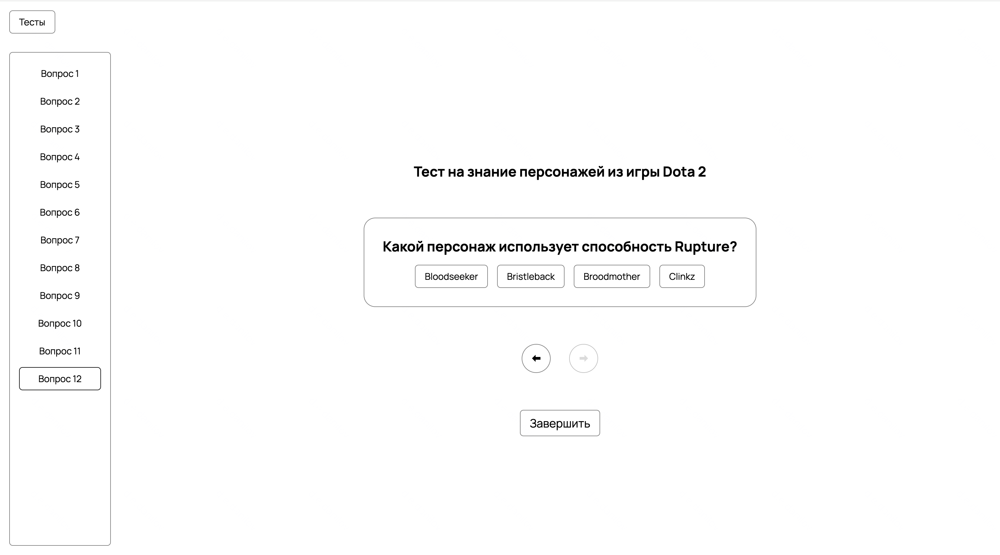

Состояние вопроса, на который ответили правильно:  
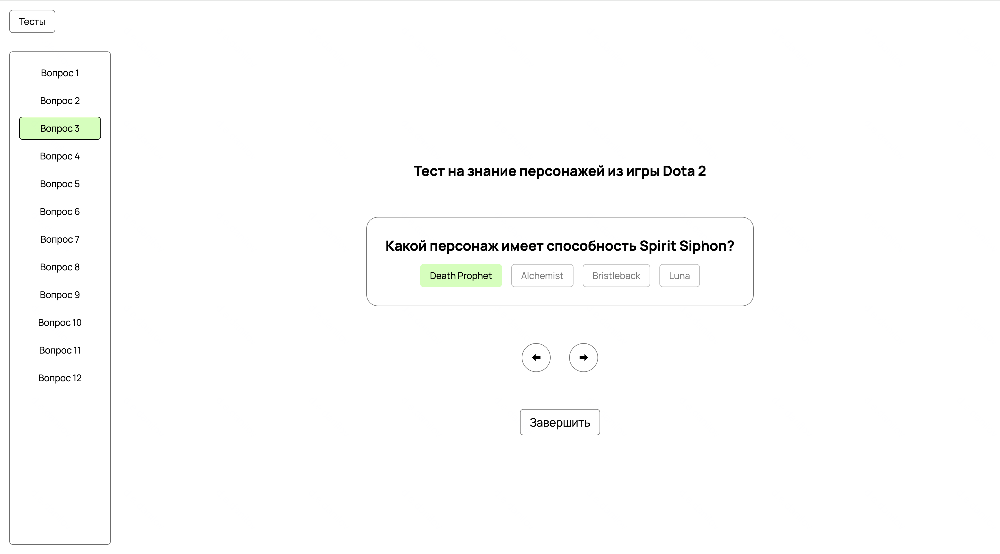

Состояние вопроса, на который ответили неправильно:  
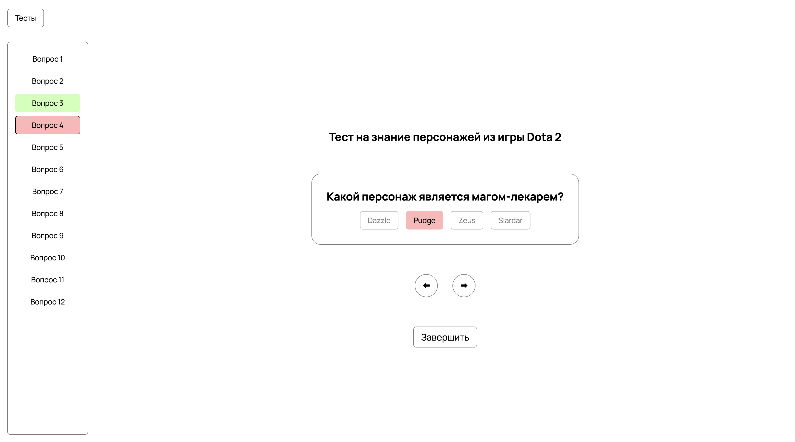

При нажатии на кнопку завершить появляется модальное окно:  

Результат теста, при нажатии на кнопку "Да":  
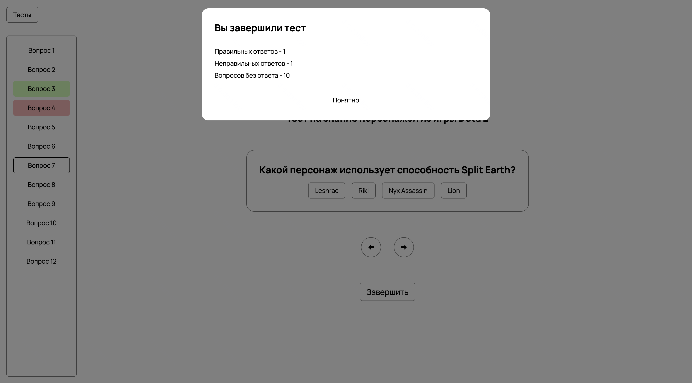

При нажатии на кнопку "Понятно" появляется кнопка "Пройти заново":  
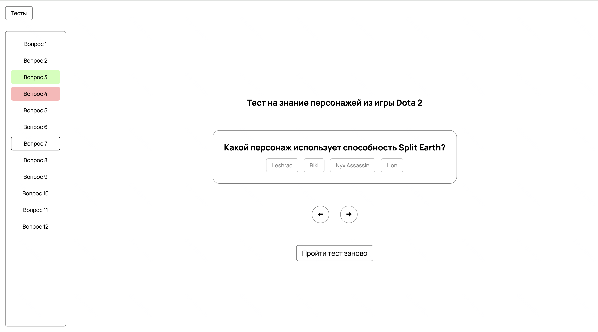

При нажатии на "Пройти заново" должно открываться модальное окно подтверждения:  
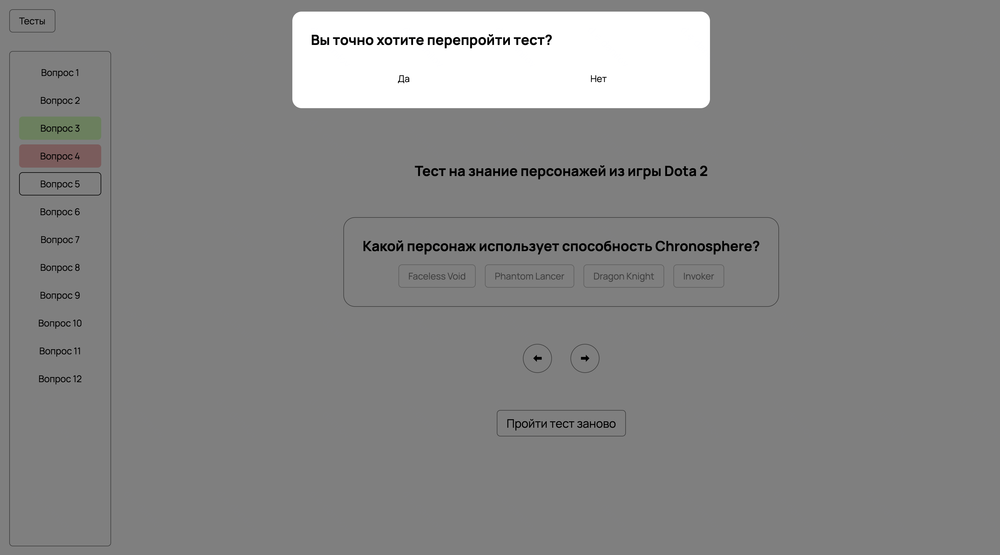

Поведение при наведении курсора на элементы:  
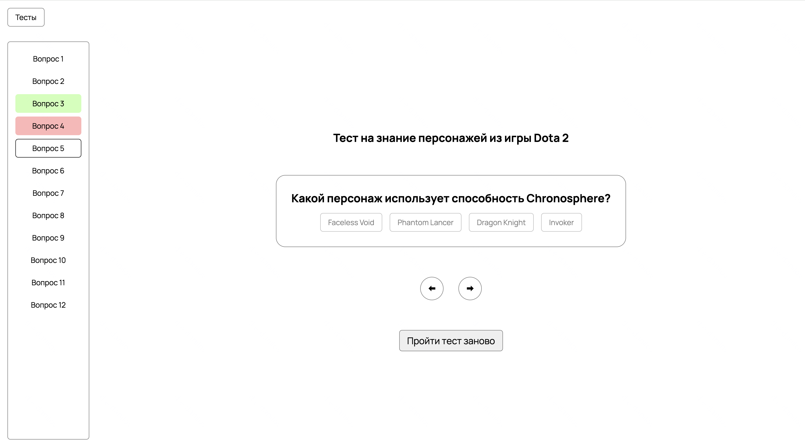  
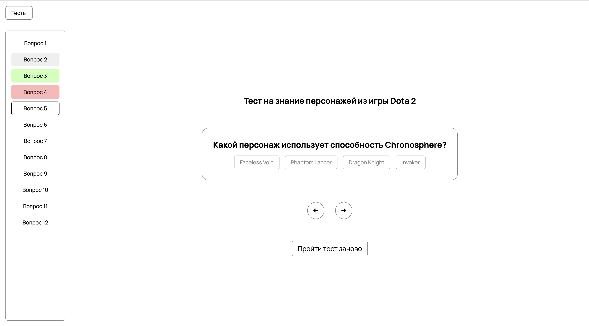

Адаптив (начало страницы):  
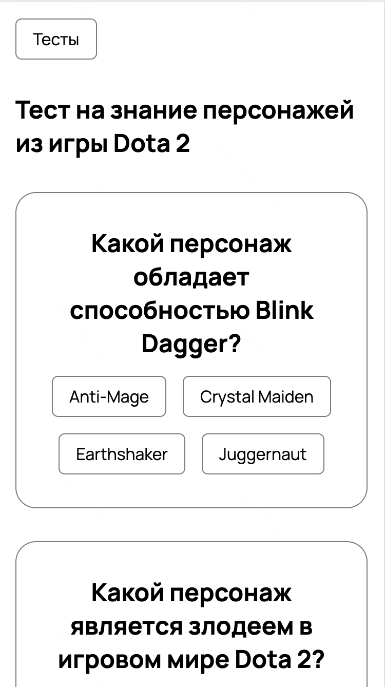

Адаптив (конец страницы):  
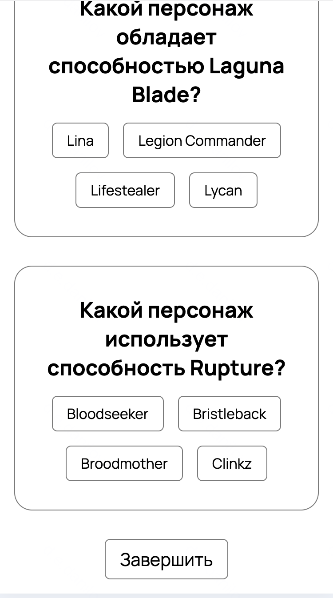

Адаптив (завершенный тест):  
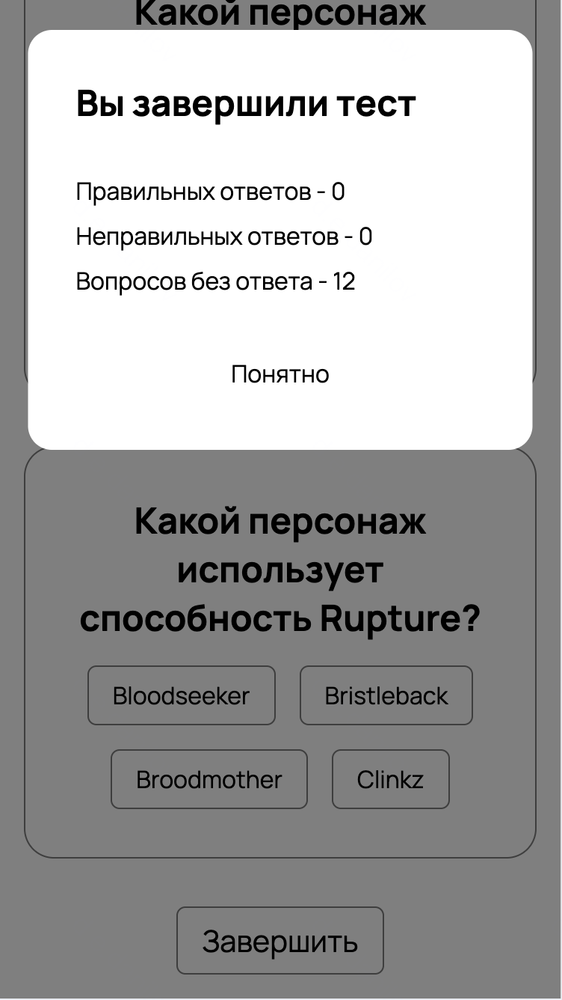

### Экран с выбором тестов

Экран со списком тестов:  

Наведение на тест в списке тестов:  
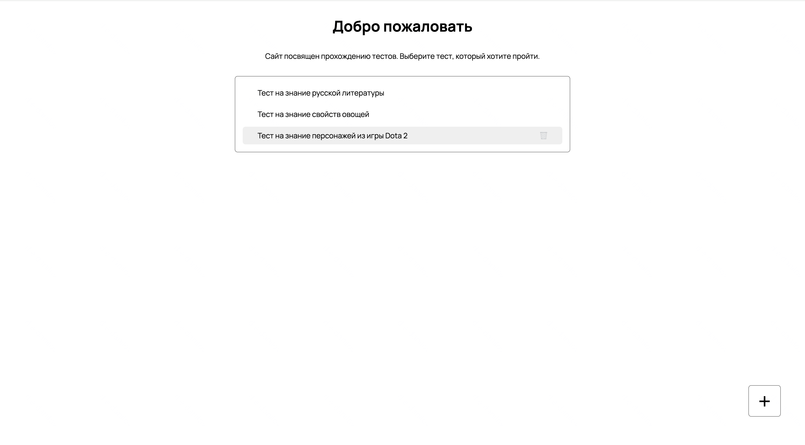

Адаптив:  
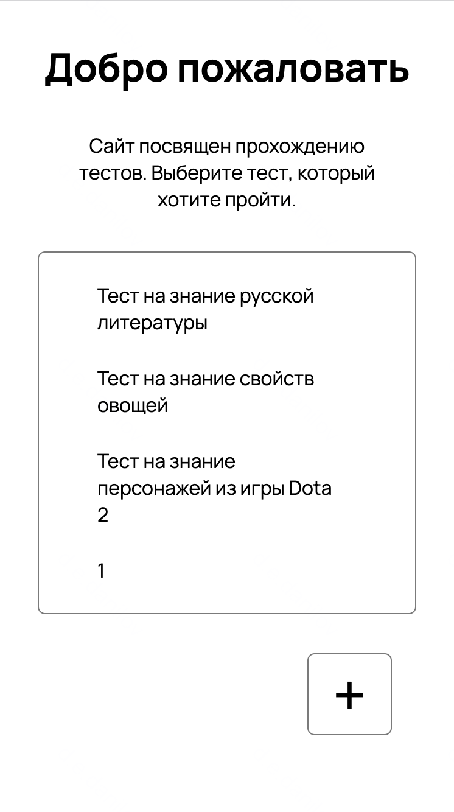

### Добавление теста

Модальное окно добавления:  
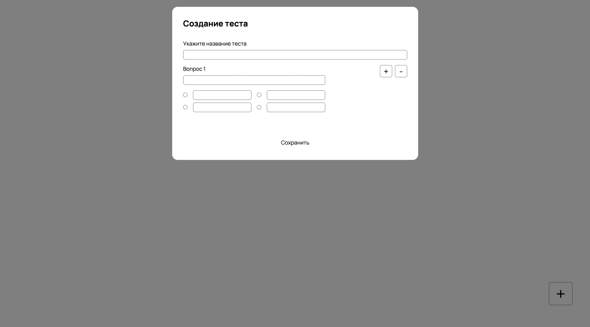

Несколько вопросов в тесте:  
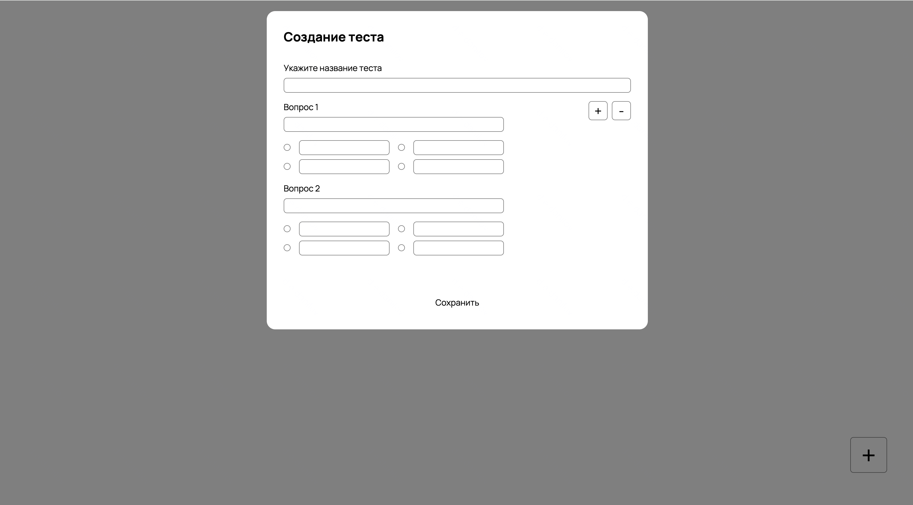

Валидация (в случае отсутствия введенных полей):  
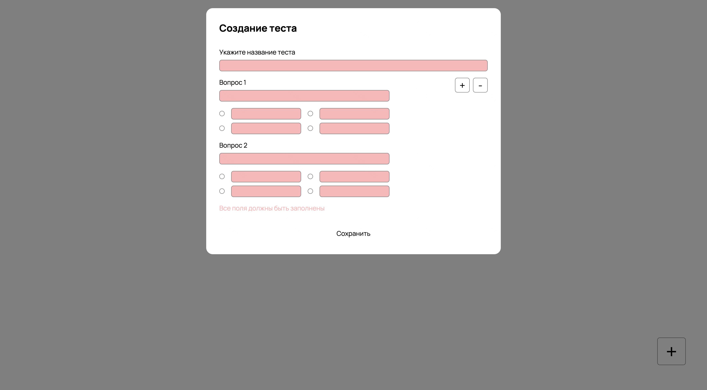

Валидация (в случае отсутствия правильного ответа):  
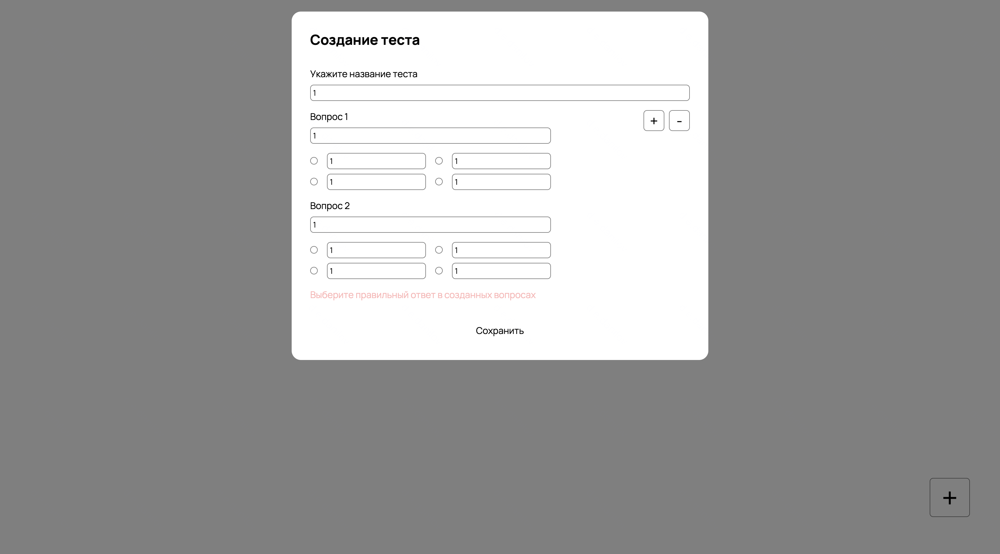

Добавленный тест (наведение на него):  

Адаптив:  
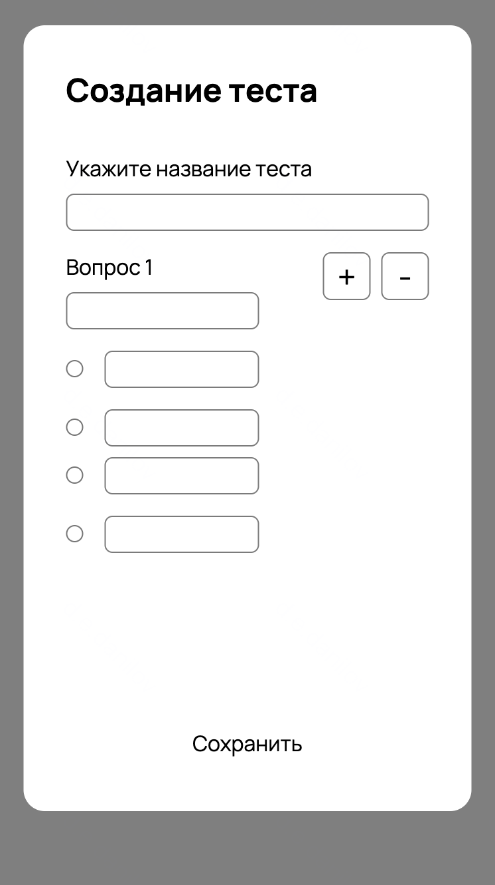

## Функционал

Вася ориентируется на следующие удобства в новой платформе:

## Часть 1. Экран прохождения теста

При открытии пути "/test/index.html?testId={id}" должен открываться экран прохождения теста. Здесь id - уникальный идентификатор теста, его пример можно найти в файле solution/data.json.
Вася предложил сделать простой вариант, где для каждого вопроса есть только один правильный ответ.

### Основная логика

У каждого теста есть ровно один правильный ответ, а вариантов ответа ровно четыре. После нажатия на ответ пользователю сразу же отображается, правильно он ответил или нет.

Пользователь может свободно переключаться вперед-назад между вопросами. Для этого на широких экранах есть кнопки "вперед" и "назад", а на узких экранах тест отображается списком, где вопросы идут друг за другом. Так пользователь сможет продолжать выполнение теста, если на какой-то вопрос он не готов ответить, а также у него будет возможность возвращаться и смотреть на выбранные ответы.

Важно не забывать про краевые случаи при навигации по тесту: недоступна навигация "назад" из первого вопроса и "вперед" из последнего. На дизайнах видно, что стрелочки становятся заблокированными и их нельзя нажимать.

Далее Вася думает о двух сценария:

- Пользователь нажимает на кнопку Завершить, если он ответил на все вопросы. Тогда показывается экран с финальным количеством очков.
- Пользователь нажимает на кнопку Завершить, если он не ответил на все вопросы. Тогда всплывается диалог с вопросом "Точно ли пользователь хочет завершить тест?":
    - Если пользователь соглашается, то выводится конечный результат
    - Если не соглашается, то пропадает диалог и тест можно продолжать

Блок с информацией о кол-ве очков, предлагается как сделано на дизайнах, где выводится:

- Кол-во правильных ответов
- Кол-во неправильных ответов
- Кол-во вопросов, на которые не были даны ответы

Если на все вопросы был дан ответ, то текст (пункт) 'Вопросов без ответа' не должен отображаться в модальном окне результатов теста.

При завершении теста появляется кнопка "Пройти тест заново", при нажатии на нее тест перезапускается.

### Боковой блок с вопросами

Вася задумался об удобстве и предложил добавить на десктопе возможность навигации по вопросам через дополнительное боковое меню, чтобы не приходилось постоянно нажимать стрелочки.

Важно, чтобы в нём была подсветка вопросов в следующем виде:

- Вопросы без выбранного ответа - никакой подсветки
- На вопрос ответили верно - зеленая подсветка
- На вопрос ответили не верно - красная подсветка

### Примечания

На дизайнах также есть хуверы - состояния при фокусе на элемент, например, наведение мыши. О них тоже не стоит забывать, ведь Вася хочет крутой UI и UX!

Не забудьте отобразить название теста на экране, согласно дизайнам.

Также на странице прохождения теста должна быть кнопка "Тесты", при нажатии на которую происходит переход на страницу выбора тестов.

## Часть 2. Экран с выбором тестов

При открытии пути "/" должен открываться экран с выбором тестов. Здесь можно выбрать интересующий тест. Помимо открытия пути "/" на этот экран можно попасть через кнопку "Тесты" из экрана прохождения теста.

Васе очень важно чтобы на его платформе было уже несколько предсозданных тестов. Так он сможет показать пользователям, какого рода тесты она поддерживает. Предсозданные тесты Вася написал сам и дал вам JSON файл (solution/data.json), из которого вам необходимо их вывести.

Просим заметить, что если Вася уже проходит какой-то тест, а затем переходит на страницу со списком и открывает другой, то в первом тесте должен сохраниться его прогресс. Тесты могут быть длинными и Вася просто устанет проходить их за раз.

## Часть 3. Добавление/удаление тестов

Не менее важная фича для Васи, чтобы он мог сам удобно создавать тесты и удалять их! Ведь только тогда он сможет в будущем показывать друзьям в уютной компании что-то новенькое.

### Основная логика

Вася предлагает сделать кнопку "Плюс" на главном экране с выбором тестов, при нажатии на которую всплывает модальное окно с формой создания теста.

В этой форме необходимо указать название теста, а также сами вопросы и варианты ответов. С помощью контролов вида radiobutton можно выбрать правильный ответ на каждый вопрос.

В модальном окне создания теста также нужно предусмотреть:

- Кнопка добавления вопроса ("+"). При нажатии на неё добавляется новый вопрос в конец списка.
- Кнопка удаления последнего вопроса ("-"). Удаляет последний вопрос из списка, но ничего не делает, если он единственный.
- Валидация. Чтобы создать тест все поля должны быть заполнены, а также должны быть выбраны правильные ответы к каждому вопросу. В дизайнах есть информация о том, как это выглядит и какую ошибку мы должны показать пользователю в разных случаях.

Когда открывается модальная форма, на всю зону вокруг должен отобразиться оверлей (получается эффект затемнения). При нажатии на любое место в этой зоне модальная форма должна закрываться.

Если форма валидно заполнена и пользователь нажал на кнопку "Сохранить", то новый тест появляется в конце списке тестов:

- При нажатии на него происходит переход на экран прохождения добавленного теста.
- Созданный тест можно удалить. Для этого нужно нажать на кнопку "Мусорки", которая должна отображаться рядом с названием при наведении на тест.

### Примечания

Изначальные тесты из JSON нельзя удалить через интерфейс. Вася очень старался их писать и не хочет чтобы вы их удаляли. При наведении на такие тесты кнопка "Мусорки" должна отображаться, но она должна быть в выключенном состоянии и нажатие на неё не должно ничего делать.

Приложение должно быть работоспособным, даже если возниклa проблема с прочтением JSON или в данных JSON ошибка.

## Часть 4. Дополнительные требования

Прогресс тестов и все новые добавленные тесты также должны сохраняться после выхода с сайта. Без этого Вася не сможет адекватно пользоваться платформой и будет очень сильно грустить :(

Советуем не забывать обрабатывать краевые случаи и не допускать в коде необработанных ошибок.

Также известно следующее:

- все отступы кратны 4 пикселям (в основном 4, 8, 16, 32)
- все скругления имеют радиус 6, 16, 20 пикселей (кое-где может быть 50%)
- все бордеры имеют ширину 1 пиксель

## Репозиторий

В репозитории вам будет доступен:

- импорт нужного шрифта в main.css
- файл reset.css, который поможет вам для синхронизацией с дизайнами
- файл variables.css, в котором хранятся css переменные (цвета и иконки)

## Технические требования

Вася страшно не любит современные фреймворки, и поэтому вас тоже просит сделать сайт с тестами на чистом JS, HTML и CSS. Нет, сделать на React/Vue/Svelte и положить собранный код в репозиторий тоже нельзя. Также ваш друг критически настроен к NPM, поэтому вы не можете ставить никакие сторонние пакеты – можно пользоваться только тем, что вам предоставил Вася. Отдельное подчеркнем что нельзя использовать JQuery и Bootstrap.

Также запрещено использовать Typescript.

Нарушение технического требования ведет к аннулированию проделанной работы.

## Система оценки

| Раздел                    | Баллы |
| :------------------------ | :---: |
| Экран прохождения теста   |  50   |
| Экран с выбором тестов    |  10   |
| Добавление/удаления теста |  30   |
| Связь между разделами     |  10   |

Ваш проект будет проверен автотестами. Некоторые тесты открыты, вы можете запускать их локально или с помощью Docker. Часть тестов закрыта. Прохождение открытой части тестов не гарантирует, что ваше решение наберет максимум баллов.

Помимо интеграционных есть и скриншотные тесты, поэтому ваша задача – повторить предоставленные в папке "tests/snapshots" скриншоты: сделать те же отступы, цвета, расположение блоков. Закрытых скриншотных тестов нет.

Открытые тесты - это дополнительный источник информации о том как должно работать ваше приложение. Если что-то не оговорено в задании, но требуется тестом - следует считать это частью условия.

Чтобы автотесты проходили, очень важно расставить элементам страницы правильные `test-id`, см. следующий раздел.

## Идентификаторы элементов для тестов

Чтобы успешно пройти тесты вам необходимо выполнить следующие требования:

### Часть 1. Список тестов

- У заголовка должен быть `test-id="list-title"`
- У подзаголовка должен быть `test-id="list-subtitle"`
- У контейнера со списком тестов должен быть `test-id="list-items"`
- У каждого названия теста в списке должен быть `test-id="list-item-title"`
- У каждой кнопки удаления теста в списке должен быть `test-id="list-item-delete"`
- У кнопки открытия формы добавления теста должен быть `test-id="list-add-button"`

### Часть 2. Форма добавления теста

- У контейнера с формой должен быть `test-id="form-modal"`
- У заголовка формы должен быть `test-id="form-title"`
- У поля ввода названия теста должен быть `test-id="new-test-title"`
- У каждого поля ввода вопроса должен быть `test-id="new-test-question"`
- Варианты ответа к каждому вопросы должны быть в контейнере с `test-id="new-test-options"`
- У кнопки добавления вопроса должен быть `test-id="add-question-button"`
- У кнопки удаления вопроса должен быть `test-id="remove-question-button"`
- У кнопки сохранения теста должен быть `test-id="save-button"`

### Часть 3. Прохождение теста

- У заголовка страницы должен быть `test-id="test-title"`
- У навигационного меню должен быть `test-id="navigation"`
- У каждого элемента навигационного меню должен быть `test-id="navigation-item"`
- У каждого видимого вопроса должен быть `test-id="question"`
- У каждого вида опции вопроса должен быть `test-id="question-option"`
- У кнопки перехода к следующему вопросу должен быть `test-id="next-question"`
- У кнопки перехода к предыдущему вопросу должен быть `test-id="prev-question"`
- У кнопки завершения теста должен быть `test-id="finish-button"`
- У кнопки сброса теста должен быть `test-id="reset-test-button"`
- У кнопки возврата на страницу со списком тестов должен быть `test-id="back-to-test-list-page"`
- У модального окна должен быть `test-id="modal"`

## Всем удачного выполнения задания! 🎉
