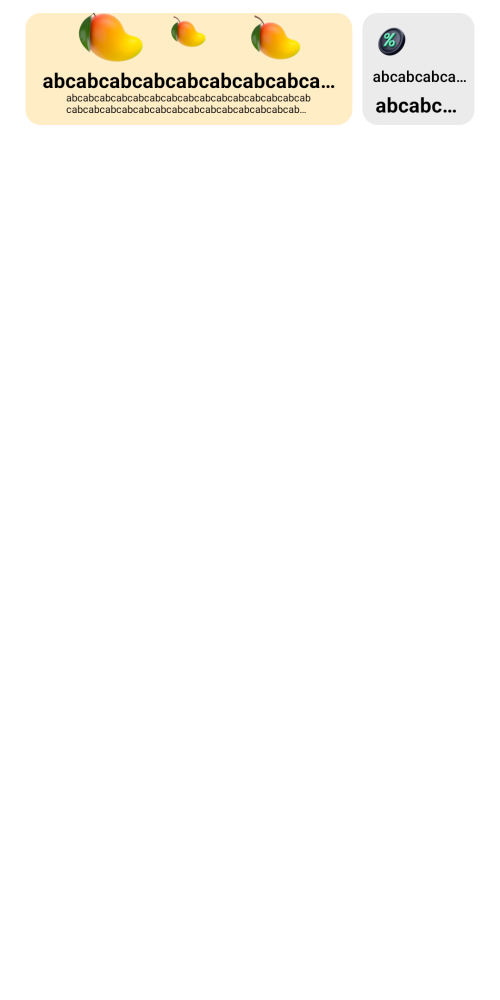

#  Задача 3 | Рекламный баннер – UI

[⬅️ назад](../README.md)

## ТЗ

Необходимо реализовать UI рекламного баннера.

### Макет

[Ссылка на макет](https://www.figma.com/design/M0ekYZvZTfk2bVRLjEtGLf/PROD-%E2%80%93-mobile-%E2%80%93-2025?node-id=1-36810&t=DVqWIKOgFAEaAa4D-4)

#### Маленький баннер

**Размеры:**
* Ширина: 88dp
* Высота: 88dp

**Задний фон:**
* Цвет: `#EBEBEB`
* Радиус: 12dp

**Изображение:**
* Размер: 35dp на 35dp
* Картина подставляется из ресурсов приложения, айди ресурса `SmallBannerUiModel.imageResId`

**Правый заголовок:**
* Размеры: максимальная ширина, высота 14dp
* Цвет текста: `#000000`
* Размер текста: 12sp
* Шрифт: sans-serif-medium
* Текст подставляется из `SmallBannerUiModel.rightLabel`
* Выравнивание текста: по концу
* Максимальноое количество строк: 1
* Обрезка текста: три точки в конце строчки
* includeFontPadding = false

**Левый заголовок:**
* Размеры: максимальная ширина, высота 20dp
* Размер текста: 16sp
* Cтиль текста: bold
* Цвет текста: `#000000`
* Текст подставляется из `SmallBannerUiModel.leftLabel`
* Выравнивание текста: по началу
* Максимальноое количество строк: 1
* Обрезка текста: три точки в конце строчки
* includeFontPadding = false

#### Большой баннер

Размеры:
* Ширина: максимальный оставшийся размер, за исключением размера маленького баннера
* Высота: 88dp

**Задний фон:**
* Цвет: `#FFEDC6`
* Радиус: 12dp

**Изображение:**
* Размер: 190dp на 40dp
* Расположение: по центру по горизонтали
* Картина подставляется из ресурсов приложения, айди ресурса `LargeBannerUiModel.imageResId`

**Заголовок:**
* Размеры: максимальная ширина, высота 18dp
* Размер текста: 16sp
* Cтиль текста: bold
* Цвет текста: `#000000`
* Текст подставляется из `LargeBannerUiModel.title`
* Выравнивание текста: по центру
* Максимальноое количество строк: 1
* Обрезка текста: три точки в конце строчки
* includeFontPadding = false

**Описание:**
* Размеры: максимальная ширина, высота 20dp
* Размер текста: 8sp
* Цвет текста: `#000000`
* Текст подставляется из `LargeBannerUiModel.description`
* Выравнивание текста: по началу
* Максимальноое количество строк: 2
* Обрезка текста: три точки в конце строчки
* includeFontPadding = false

### Рекомендации

Для конвертирования `dp` -> `px` и обратно в коде можно использовать методы из файла `UnitConverter`:
* spToPx(): Float
* dpToPx(): Int
* dpToPxAsFloat(): Float

### Эталон

## Ограничения

Из класса `BannerView` нельзя удалять/менять сигнатуру методов:
- конструктора,
- setupBanner(model: BannerUiModel)

т.к эти методы используется другими классами

## Ожидаемое решение

Необходимо реализовать `BannerView` в соответствии с макетом, в том числе реализовать логику внутри метода инициализации баннера `setupBanner(model: BannerUiModel)`

(в своей реализации вы можете на свое усмотрение выбрать класс от которого будет наследоваться `BannerView`, в эталонном решении в качестве основного контейнера использовался `ConstraintLayout`)