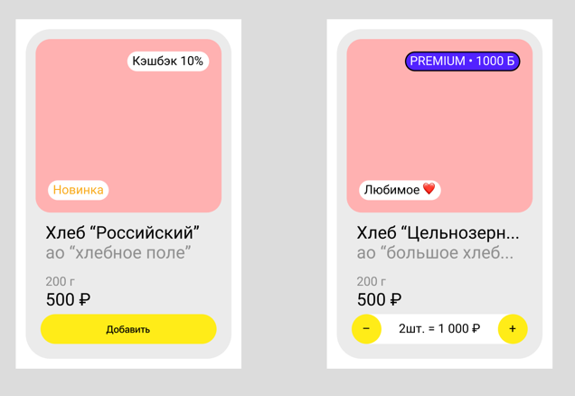
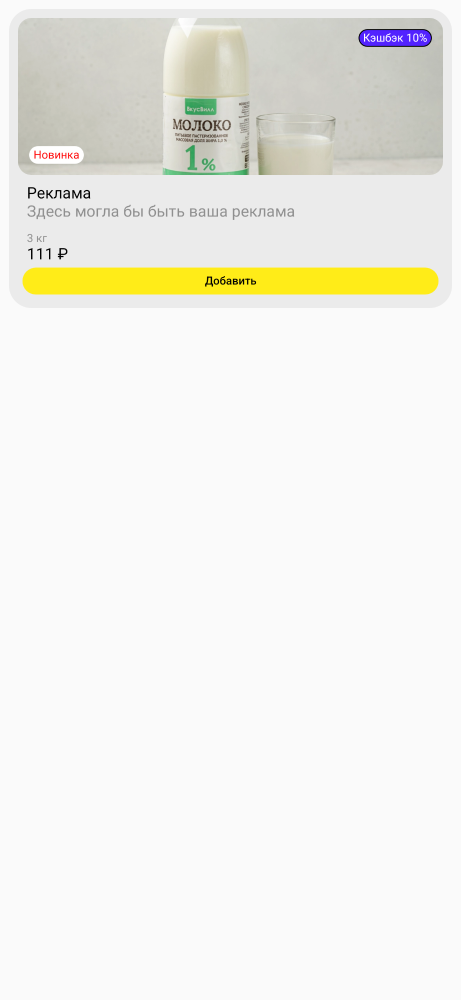
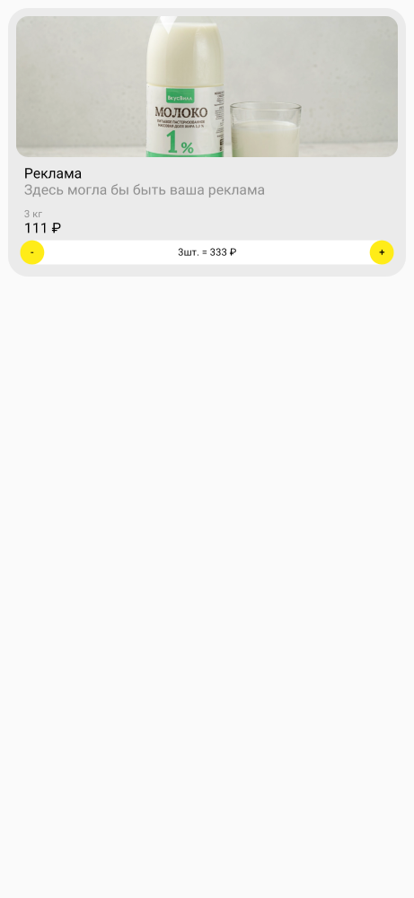

# Задача 6 | Товарная витрина – UI

[⬅️ назад](../README.md)

## ТЗ

Необходимо реализовать UI элемент товара главного экрана `GoodsItemView`.
Все текста имеют системный шрифт Roboto (ничего не устанавливаем в поле шрифт). Для необычных
символов типа "₽" используйте `Const`, который уже лежит у вас в проекте.

### Макет

#### Контейнер ячейки

- Размеры: по ширине родителя, по высоте контента
- Отступы: `8dp`
- Цвет фона: `#EBEBEB`
- Радиус скругления: `20dp`

#### Изображение товара

- Размеры: по ширине контента, высота - `140dp`
- Отступы: `8dp`
- Цвет фона: `#FFB1B1`
- Радиус скругления: `12dp`
- scaleType: `centerCrop`
- Изображение: `GoodsItemUi.imageRes`

#### Верхний лейбл - `GoodsBonusUi`

- Размеры: по ширине контента, по высоте контента
- Размер текста: `10sp`
- Радиус скругления: `20dp`
- Отступы: `10dp`
- Цвет текста: `GoodsBonusUi.textColor`
- Цвет фона: `GoodsBonusUi.backgroundColor`
- Цвет обводки: `GoodsBonusUi.borderColor`
- Размер обводки: `1dp`
- Макс строк: `1`
- Обрезание текста: `3 точки в конце строки`
- includeFontPadding: `false`

#### Нижний лейбл - `GoodsFavouriteUi`

- Размеры: по ширине контента, по высоте контента
- Размер текста: `10sp`
- Радиус скругления: `20dp`
- Отступы: `10dp`
- Цвет текста: `GoodsFavouriteUi.textColor`
- Цвет фона: `#FFFFFF`
- Макс строк: `1`
- Обрезание текста: `3 точки в конце строки`
- includeFontPadding: `false`

#### Название товара

- Размеры: по ширине родителя, по высоте контента
- Отступы: по горизонтали - `16dp`, сверху `8dp`
- Цвет текста: `#000000`
- Размер текста: `14sp`
- Макс строк: `1`
- Обрезание текста: `3 точки в конце строки`
- includeFontPadding: `false`

#### Имя производителя

- Размеры: по ширине родителя, по высоте контента
- Отступы: по горизонтали - `16dp`
- Цвет текста: `#8F8F8F`
- Размер текста: `14sp`
- Макс строк: `1`
- Обрезание текста: `3 точки в конце строки`
- includeFontPadding: `false`

#### Вес

- Размеры: по ширине родителя, по высоте контента
- Отступы: по горизонтали - `16dp`, сверху `10dp`
- Цвет текста: `#8F8F8F`
- Размер текста: `10sp`
- Макс строк: `1`
- Обрезание текста: `3 точки в конце строки`
- includeFontPadding: `false`

#### Цена

- Размеры: по ширине родителя, по высоте контента
- Отступы: по горизонтали - `16dp`
- Цвет текста: `#000000`
- Размер текста: `14sp`
- Макс строк: `1`
- Обрезание текста: `3 точки в конце строки`
- includeFontPadding: `false`

#### Кнопка “Добавить”

- Размеры: по ширине родителя, высота - `24dp`
- Отступы: по горизонтали - `12dp`, снизу - `12dp`, сверху - `4dp`
- Цвет текста: `#000000`
- Цвет фона: `#FFEC18`
- Размер текста: `10sp`
- Радиус скругления: `12dp`
- Макс строк: `1`
- Обрезание текста: `3 точки в конце строки`
- Выравнивание: `По центру`
- includeFontPadding: `false`
- elevation: `0`
- textAllCaps: `false`
- style: `?android:attr/borderlessButtonStyle`

#### Кнопки добавления/удаления товара

- Размеры: `24dp`
- Отступы: по горизонтали - `12dp`, снизу - `12dp`, сверху - `4dp`
- Цвет текста: `#000000`
- Цвет фона: `#FFEC18`
- Размер текста: `10sp`
- Радиус скругления: `12dp`
- Выравнивание: `По центру`
- includeFontPadding: `false`
- style: `?android:attr/borderlessButtonStyle`

#### Информация о количестве товара в корзине

- Размеры: высота - `24dp`
- Отступы: снизу - `12dp`, сверху - `4dp`
- Размер текста: `10sp`
- Цвет текста: `#000000`
- Цвет фона: `#FFFFFF`
- Выравнивание: `По центру`
- includeFontPadding: `false`

### Рекомендации

Для конвертирования `dp` -> `px` и обратно в коде можно использовать методы из файла
`UnitConverter`:

* spToPx(): Float
* dpToPx(): Int
* dpToPxAsFloat(): Float

---

Размеры и отступы так же можно смотреть из макетов, с помощью зажатой клавиши alt (option).

### Эталон

## Ограничения

Из класса `GoodsItemView` нельзя удалять/менять сигнатуру методов:

- конструктора,
- updateState(item: GoodsItemUi)
- setAddToCartButtonClickListener(onClick: () -> Unit)
- setIncreaseQuantityClickListener(onClick: () -> Unit)
- setDecreaseQuantityClickListener(onClick: () -> Unit)

т.к эти методы используется другими классами

## Ожидаемое решение

Необходимо реализовать `GoodsItemView` в соответствии с макетом, в том
числе реализовать логику внутри метода обновления элемента `updateState(item: GoodsItemUi)`

Также необходимо добавить слушатели нажатий на соответсвующие кнопки в методах:

- setAddToCartButtonClickListener
- setIncreaseQuantityClickListener
- setDecreaseQuantityClickListener

(в своей реализации вы можете на свое усмотрение выбрать класс от которого будет наследоваться
`GoodsItemView`,
в эталонном решении в качестве основного контейнера использовался `ConstraintLayout`)
