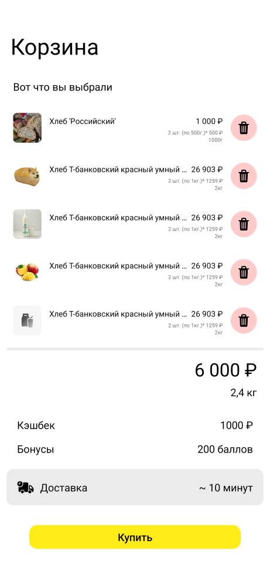
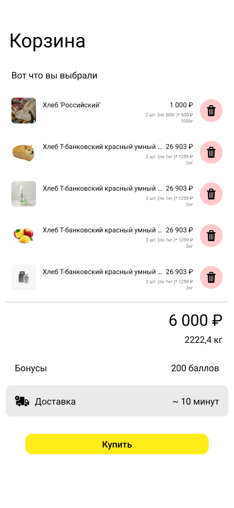
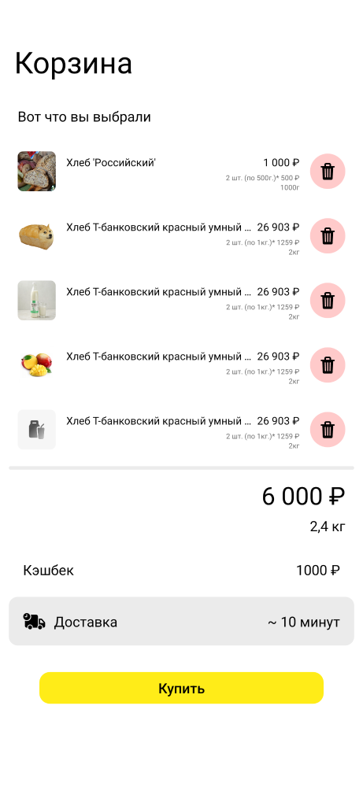
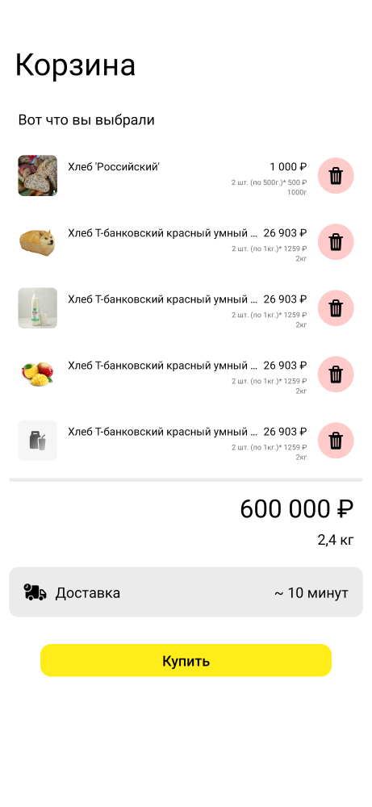

#  Задача 9 | Корзина – UI

[⬅️ назад](../README.md)

## ТЗ

Необходимо реализовать весь экран корзины.
Все надписи имеют системный шрифт Roboto (ничего не устанавливаем в поле шрифт). Цвет надписи черный - #000000, если не указано иного.
Для необычных символов типа ₽ используйте `Const`, который уже лежит у вас в проекте.

1. Фон: белый - #FFFFFF
2. Надпись Корзина:
	1. Ширина и Высота: wrap_content
	2. Отступ справа: 16dp, отступ сверху: 47dp
	3. Размер: 34sp
3. Надпись Вот что вы выбрали:
   1. Ширина и высота: wrap_content
   2. Отступ слева от края экрана: 20dp, отступ сверху от надписи Корзина: 28dp.
   3. Размер: 16sp
4. Список с товарами:
	1. Ширина: match_parent, высота: wrap_content
	2. Отступы по бокам от края экрана: 10dp, отступ сверху от надписи Вот что вы выбрали:  20dp
	3. Отступ между элементами: 10dp
5. Элемент списка корзины (ширина: match_parent, высота: 63dp):
	1. Картинка товара:
		1. Берется с помощью функции imageIdToResId из поля товара imageId
		2. Ширина: 43dp, высота: 45dp
		3. Отступ сверху и снизу от краёв карточки: 9dp, отступ слева: 10dp
		4. Подсказка: используй scaleType="fitXY"
		5. Края должны быть скруглены на 6dp
	2. Название продукта:
		1. Ширина подстраивается под размеры картинки и цены товара, высота: wrap_content
		2. Отступ сверху от края карточки: 12dp, слева от картинки: 13dp, справа от цены товара: 6dp
		3. Размер: 12sp
		4. При нехватке места должны показываться точки
		5. Занимает одну строку
	3. Цена товара:
		1. Ширина и высота: wrap_content
		2. Отступ сверху от края карточки: 13dp, отступ справа от кнопки корзины: 12dp
		3. Размер текста: 12sp
		4. Должен показываться в формате 100 500 ₽ (каждые три цифры числа через пробел (разделение на тысячи, единицы) + " ₽"). Примеры: 1 500 ₽, 100 500 ₽, 10 500 ₽
		5. Рассчитывается в задаче 7 как количество товара * его стоимость.
	4. Информация о количестве, цене за штуку и весе:
		1. Ширина и высота: wrap_content
		2. Отступ сверху от цены: 4dp, отступ справа от кнопки корзины: 12dp
		3. Цвет текста: #6D6D6D
		4. Размер: 8sp 
		5. Рассчитывается так: *количество штук в корзине* + "шт. " + "(по *вес одного товара*г/кг.)"* *стоимость одного товара* + " ₽". Там где нет пробела - не ошибка, там правда нет пробела.
	5. Вес всего наименования:
		1. Ширина и высота: wrap_content
		2. Отступа сверху от информации о количестве нет, отступ справа от кнопки корзины: 12dp
		3. Размер: 8sp
		4. Цвет: #6D6D6D 
		5. Рассчитывается как количество в корзине * вес одного товара + " г/кг"
	6. Кнопка Корзины:
		1. Ширина и высота: 40dp
		2. Отступ от краёв карточки сверху и снизу: 11.5dp, отступ справа от края карточки: 10dp
		3. Фон должен быть цветом #FFCACA и иметь скругление 20dp
		4. Картинка: R.drawable.bucket
		5. При нажатии удаляем товар (устанавливаем клик листенер из аргументов `CartScreenView.updateState`)
6. Разделитель:
	1. Ширина: match_parent, высота: 4dp
	2. Отступы по бокам и сверху (от списка с товарами): 10dp
	3. Должен иметь цвет #EBEBEB и скругление в 10dp
7. Общая стоимость корзины:
	1. Ширина и высота: wrap_content
	2. Отступ сверху от разделителя: 10dp, справа: 20dp
	3. Размер: 28sp
	4. Должен показываться в формате 100 500 ₽ (каждые три цифры числа через пробел (разделение на тысячи, единицы) + " ₽"). Примеры: 1 500 ₽, 100 500 ₽, 10 500 ₽
8. Общий вес:
	1. Ширина и высота: wrap_content
	2. Отступ сверху от общей стоимости: 5dp, справа: 20dp
	3. Размер: 16sp
	4. Отображается в в формате: *кол-во кг* + " кг". Количество килограммов в десятичной дроби с запятой.
9. Секция с бонусами (кешбек и бонусы):
	1. Ширина: match_parent, высота: wrap_content.
	2. Отступы по бокам: 26dp, отступ сверху от общего веса: 28dp
	3. Надпись Кешбек/Бонусы:
		1. Ширина и высота: wrap_content
		2. Размер: 16sp
	4. Число бонусов или кешбека:
		1. Ширина и высота: wrap_content
		2. Отображаем по правому краю
		3. Размер: 16sp
		4. Для кешбека:
			1. Должен показываться в формате 100 500 ₽ (каждые три цифры числа через пробел (разделение на тысячи, единицы) + " ₽"). Примеры: 1 500 ₽, 100 500 ₽, 10 500 ₽
		5. Для бонусов:
			1. Должен показываться в формате *число баллов* + " баллов"
	5. Между Кешбеком и Бонусами промежуток размером 14.5dp
	6. Сначала показываем кешбек, затем бонусы
	7. Если кешбек или бонусы равны нулю, не показываем соответствующие надписи.
	8. Должен сохраниться отступ сверху от общего веса: 28dp при скрытии секций кешбека или бонусов.
10. Плашка доставки:
	1. Ширина: match_parent, высота: 55dp
	2. Отступы по бокам: 10dp, сверху от секции с бонусами: 20dp
	3. Фон имеет цвет: #EBEBEB, скруглен на 10dp
		1. Картинка грузовика:
			1. Ширина: 25dp, высота: 19dp
			2. Отступ от краев плашки сверху и снизу: 18dp, отступ слева от края: 16dp
			3. Картинка: R.drawable.delivery
		2. Надпись Доставка:
			1. Ширина и высота: wrap_content
			2. Отступ от краев плашки сверху и снизу: 18dp, отступ слева от картинки с грузовиком: 10dp
			3. Размер: 16sp
		3. Надпись ~ 10 минут:
			1. Ширина и высота: wrap_content
			2. Отступ от краев плашки сверху и снизу: 18dp, отступ справа от края плашки: 16d
			3. Размер: 16sp
11. Кнопка Купить:
	1. Ширина: match_parent, высота: 36dp
	2. Отступ от краев экрана слева и справа: 44.5dp, отступ сверху от плашки Доставка: 30dp
	3. Текст: Купить (именно в таком формате, первая заглавная, остальные строчные)
	4. Фон имеет цвет: #FFEC18 и скругление: 12dp
	5. Размер текста: 16sp
	6. Подсказка: установите стиль: style="?android:attr/borderlessButtonStyle"
	7. При нажатии переходим на экран оплаты (устанавливаем клик листенер из аргументов `CartScreenView.updateState`)
	

### Макет

### Эталон

## Ожидаемое решение

Необходимо реализовать `CartScreenView` в соответствии с макетом и ТЗ.
