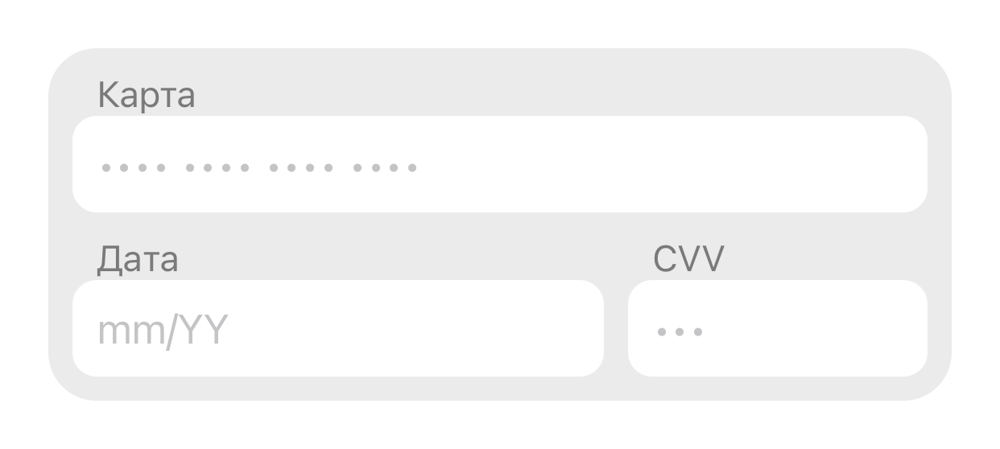
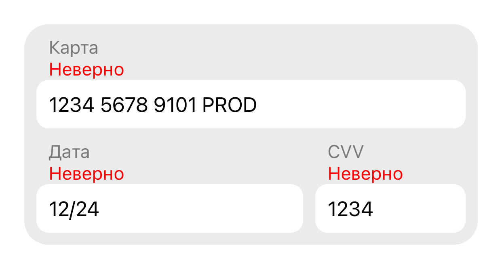

#  Задача 11 | Оплата – UI

[⬅️ назад](../README.md)

## ТЗ

Необходмио реализовать виджет формы ввода.

### Макет

https://www.figma.com/design/M0ekYZvZTfk2bVRLjEtGLf/PROD-%E2%80%93-mobile-%E2%80%93-2025?node-id=1-15420&t=XLt1pX99MxsYJILb-1

плейсхолдеры
- карта •••• •••• •••• ••••
- дата mm/YY
- cvv •••

### Эталон

## Ожидаемое решение

Необходимо реализовать `CardInputView` в соответсвии с макетом
