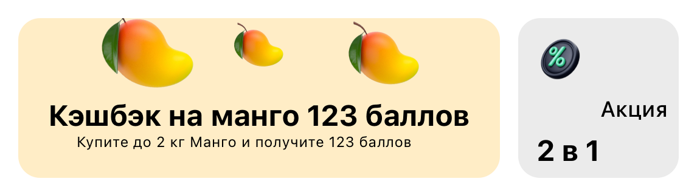

#  Задача 3 | Товарный баннер – UI

[⬅️ назад](../README.md)

## ТЗ

Необходмио реализовать UI товарного баннера (view в 3х состояниях).

### Макет

https://www.figma.com/design/M0ekYZvZTfk2bVRLjEtGLf/PROD-%E2%80%93-mobile-%E2%80%93-2025?node-id=1-27587&t=XLt1pX99MxsYJILb-1

### Эталон

## Ожидаемое решение

Необходимо реализовать `GoodsBannerView` в соответсвии с макетом

