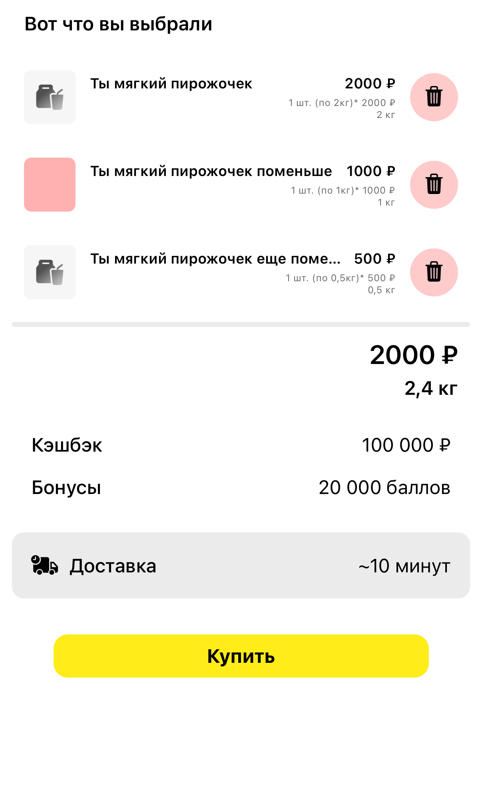

#  Задача 9 | Корзина – UI

[⬅️ назад](../README.md)

## ТЗ

Необходмио реализовать UI экрана корзины.

### Макет

https://www.figma.com/design/M0ekYZvZTfk2bVRLjEtGLf/PROD-%E2%80%93-mobile-%E2%80%93-2025?node-id=1-21601&t=XLt1pX99MxsYJILb-1

### Эталон

## Ожидаемое решение

Необходимо реализовать `CartView` в соответсвии с макетом
